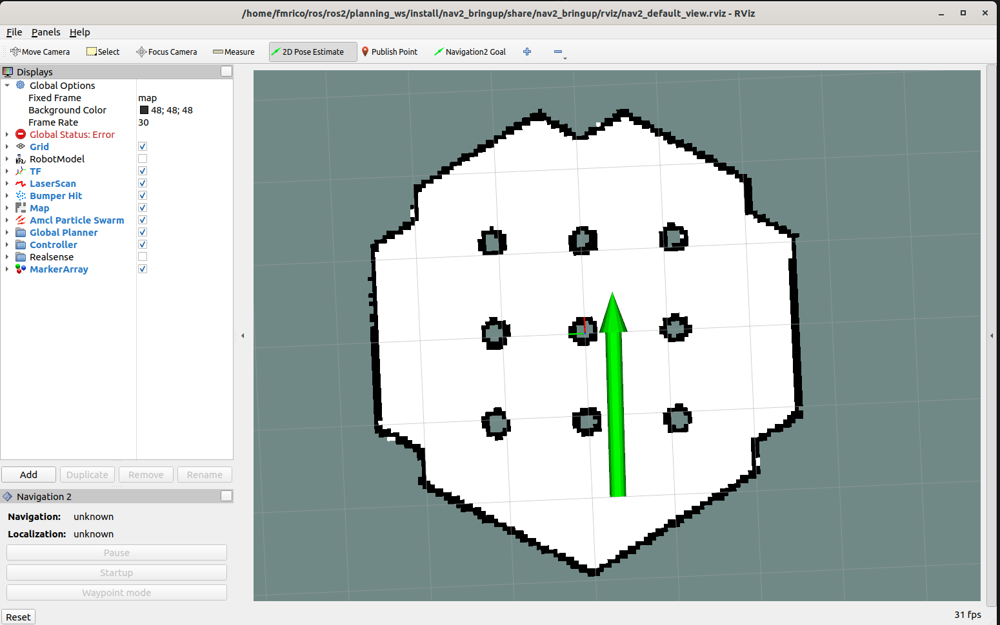

# PlanSys2 Behavior Tree Example

## Description

This example shows how to use Behavior Trees to carry out the tasks that an action requires. Each action has an xml file that defines a behavior tree.
- In `src` the actions are implemented.
- In `src / behavior_tree_nodes` BT nodes.

See https://github.com/IntelligentRoboticsLabs/ros2_planning_system/pull/27 for details.

## How to run

In terminal 1:

```bash
export GAZEBO_MODEL_PATH=$GAZEBO_MODEL_PATH:/opt/ros/humble/share/turtlebot3_gazebo/models
export TURTLEBOT3_MODEL=waffle
source /usr/share/gazebo/setup.sh
ros2 launch nav2_bringup tb3_simulation_launch.py headless:=False
```

This launches Navigation2. Use rviz to set the robot position, as shown here:

 

In terminal 2:

```bash
source $HOME/dev_ws/install/setup.bash
ros2 launch plansys2_bt_example plansys2_bt_example_launch.py
```

In terminal 3:

```bash
ros2 run plansys2_terminal plansys2_terminal
```

```text
set instance r2d2 robot

set instance recharge_zone zone
set instance wheels_zone zone
set instance steering_wheels_zone zone
set instance body_car_zone zone
set instance assembly_zone zone

set instance wheel_1 piece
set instance body_car_1 piece
set instance steering_wheel_1 piece

set predicate (robot_available r2d2)
set predicate (robot_at r2d2 assembly_zone)
set predicate (is_recharge_zone recharge_zone)
set predicate (piece_at wheel_1 wheels_zone)
set predicate (piece_at body_car_1 body_car_zone)
set predicate (piece_at steering_wheel_1 steering_wheels_zone)

set goal (and(piece_at wheel_1 assembly_zone))

run
```
